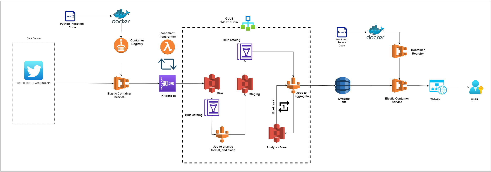
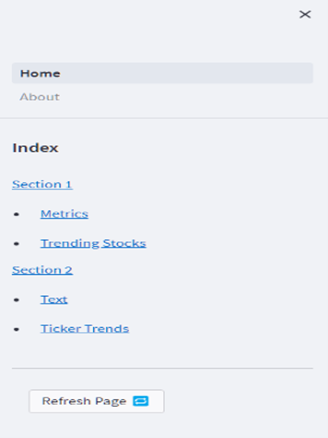
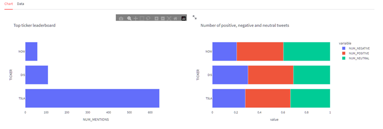
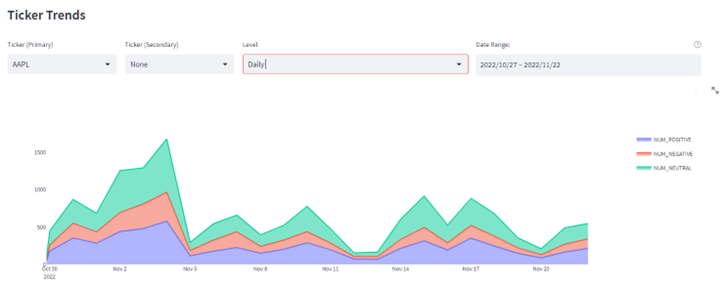
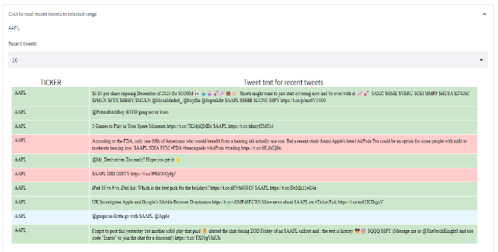

# AwsStreamingDataAnalysis

## About this project
        
Big data and Cloud computing technologies have become mainstream in the past two decades, and are being used by every organization to store, process and analyze large volumes of data.   

The tools for big data have evolved as well, with organizations using a wide range of big-data technologies for a variety of use-cases. Furthermore, with the adoption of cloud technologies, the big-data landscape has also transformed with these organizations moving their big-data operations from on-premises architecture to cloud-native solutions. 
    
Our capstone project deals with implementing a cloud based big-data pipeline to analyze the stock market tweets on Twitter.   
The main objective of this project is to use multiple cloud native services to familiarize oneself with the application and interaction of the services to create a working big-data pipeline.
    
The big-data pipeline implemented in this project is a batch processing ETL pipeline, where the data source is a real-time streaming source: the Twitter streaming API endpoint, which allows developers to get live tweets as they are posted to the platform.   
The project makes use of variety of cloud services to ingest streaming data, store the data, and process the data using Spark distributed computing framework, and store the end results of analysis in a NoSQL database that is used by front-end dashboard application. The front-end dashboard application enables the user to change variables to deep dive into the collected data and gain useful insights. 

# Architecture diagram

The architecture of the project is based on the ETL methodology that is used very commonly for Big Data pipelines. ETL (Extract, Transform, Load) is about extracting data sources, transforming the data by using business logic, and loading the data into target databases or data warehouses

The overall pipeline consists of Extract, Transform and Load stages which is as follows -  

## Extract
The extract component of the pipeline consists of ingestion services present in AWS cloud. The extract stage of the architecture uses aws services as described below 
1. Elastic Container Registry: Used to store the docker image for twitter data ingestion code
2. Elastic Container Service: Used to run the docker image within ECR as a persistent container 
3. Kinesis Firehose: Used to ingest real-time streaming data from Twitter 

### Key Points

*Kinesis Firehose Stream Transformation*  
We are using Kinesis Firehose to process the streaming data sent by the ingestion code and store it in the target S3 location. To process the stream records, we are using lambda transformer which is a feature built into Kinesis Firehose that allows the lambda function to process the records before they are sent to the target data location, which in our case is an S3 bucket. The stream transformation that takes place is the sentiment analysis of the tweet text. Figure 6 shows an example of a tweet that was categorized as negative by the transformation function before it landed to S3 bucket.

## Transform
The transform component of the pipeline consists of data storage, cataloging and Big Data processing services present in AWS cloud. The transform stage of the architecture uses the aws services as described below – 
1. S3: Used to store the data in data lake architecture style
2. Glue Crawler: Used to crawl data in S3 to generate hive metastore compatible catalog 
3. Glue Pyspark Jobs: Used to run Pyspark jobs to process and transform data in S3
4. Glue Job Workflow: Used to orchestrate the batch ETL jobs and crawlers to run on schedule
More implementation details can be found in the project report resource pdf file

## Load and Serve
The load component of the pipeline is responsible for loading / updating the serving layer. We have used DynamoDB for the serving layer, which acts as the primary data source for the front-end user dashboard. DynamoDB is a serverless, distributed and highly scalable key-value document database that is provided by AWS cloud. This is also the key technology used in the serving layer of our architecture.  
To support the front-end dashboard queries, we have created three DynamoDB tables, the schema of which has been designed based on the user query patterns that were decided in the planning stage of project

## Results
The product that we have created is a user dashboard, that is a web application. The dashboard application allows the user to deep dive into the tweet summaries by making selections such as the level of detail required (yearly, hourly etc.) or ticker symbol and timeframe of interest. The various elements and functions of the dashboard application are as follows – 

### Element 1 – Sidebar

The first element of design as shown by Figure 4, is the sidebar element. The functional value of this element is only to show the index, or the table of contents, and a manual refresh button if the user needs to force refresh the page elements.

### Element 2 – User Selections and Overall metrics
As can be seen in figure 10, this element of the page, allows the user to select the detail level, example, the user can select to the top trending stocks data on Yearly, Monthly, Daily or Hourly level. They can see the trending symbols and sort it based on number of mentions or based on positive, negative, and neutral ratios.

Based on the user selection, the metric data changes dynamically to reflect the total, positive, negative tweets in the timeframe selected.

*Leaderboard*

In figure 11, we have the trending stocks chart that is another element of the dashboard. We can see the top 3 or 5, or 15 tickers that match the selection criteria. In addition to the ranking, we can see the proportions of positive, negative, and neutral tweets in each of the top tickers.

### Element 3 – Recent tweets analysis

As can be seen in figure 12, the user can make selections, such as fetching the top 100 tweets, and filter the tweets that contain a particular TICKER symbol. The individual tweets listed are highlighted per the sentiment classification of the tweet. 
In figure 8, we can see a word cloud has been generated for the top tweets. This allows the user to identify any high-level patterns, such as topics or any trendy words in the tweets.

### Element 4 – Ticker sentiment trend over time

In this element of the UI, we help the user understand the trend of a particular TICKER, for example AAPL in figure 13. We can select the level of the data, like monthly, hourly, daily. The chart depicted is interactive and allows the user to zoom into certain areas of interest in the chart.

*Recent tweets for the TICKER in selection*

As a sub element, we are also displaying to the user the recent tweets for the selected TICKER, in the selected timestamp. The same is shown in figure 14.
In addition to tweets, we show the sentiment by using color highlights.

### Accessing the application
The application dashboard can be accessed at the address http://3.84.15.57:8080/
 
*Note – The website does not use https and no domain name, so is blocked on some networks. For example, it is not opening on cestar database network.*

